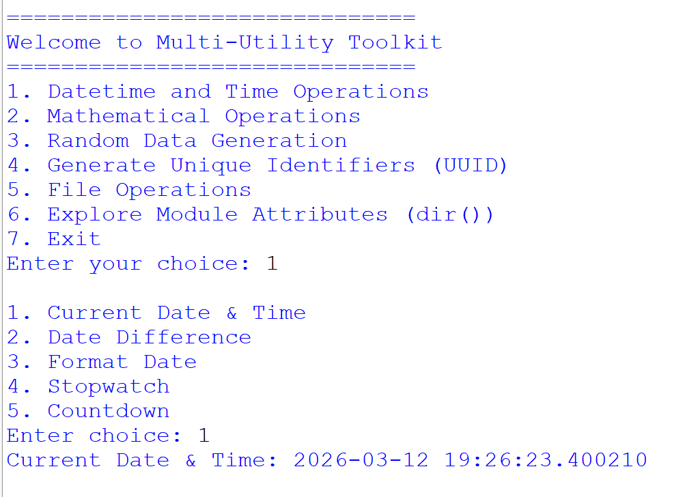
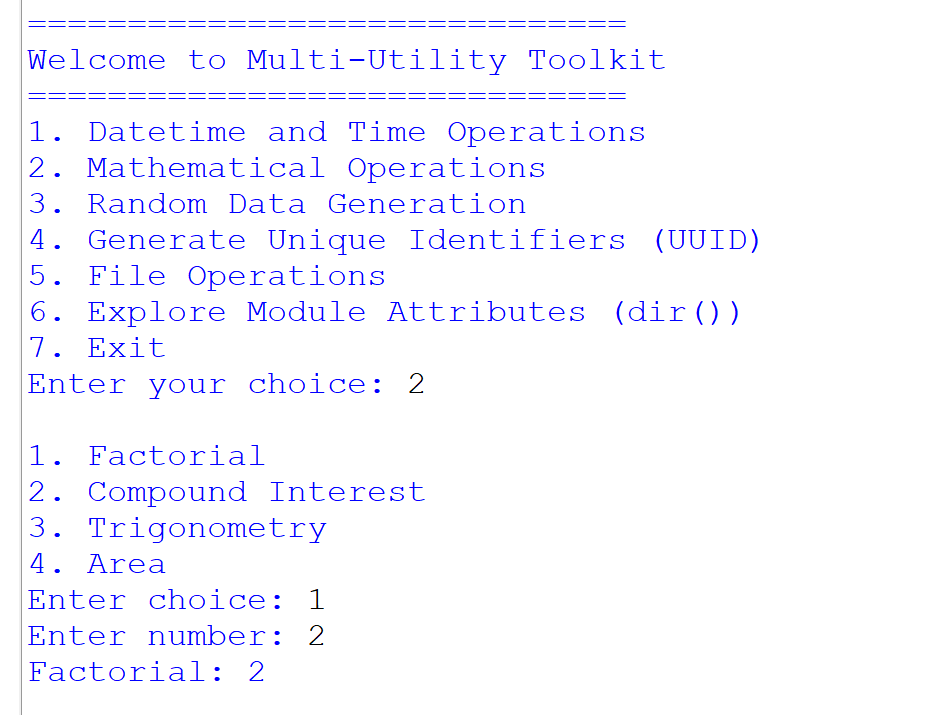
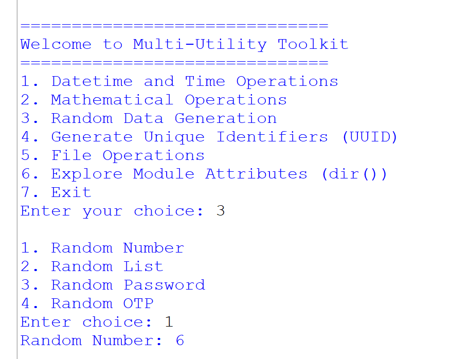
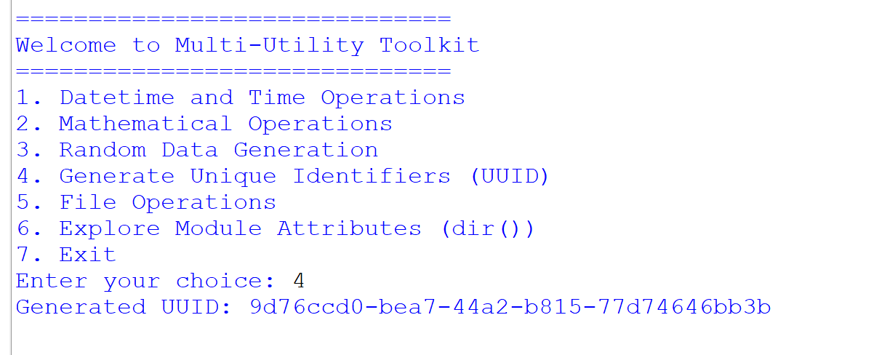
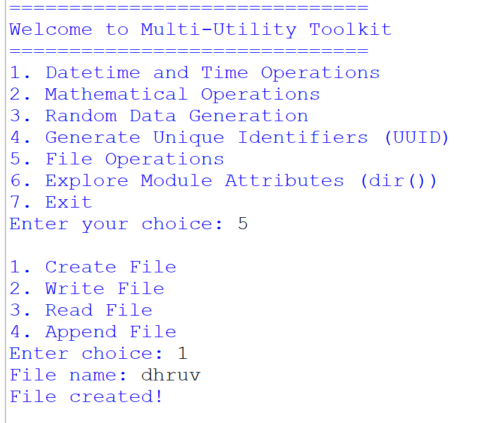
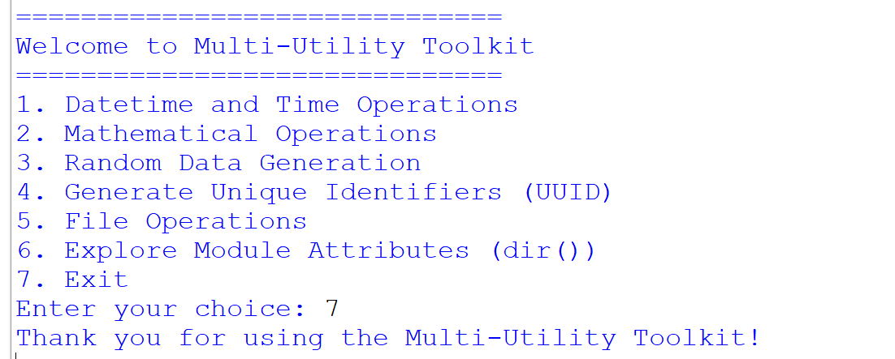

# 📦 Multi-Utility Toolkit (Python CLI Project)

🚀 A powerful command-line Python toolkit that combines multiple useful utilities into a single program.

This project demonstrates the use of several Python standard libraries such as **datetime, math, random, uuid, os, time, and string**.

---

## ✨ Features

* ✅ Menu-driven CLI interface
* ✅ Beginner-friendly project
* ✅ Uses multiple Python built-in modules
* ✅ Covers loops, functions, and conditions
* ✅ Real-world utilities in one tool

---

## 🧰 Technologies Used

* 🐍 Python 3
* 📦 Modules Used:

  * datetime
  * math
  * random
  * uuid
  * os
  * time
  * string

---

## 📋 Main Menu

```
1. Datetime and Time Operations
2. Mathematical Operations
3. Random Data Generation
4. Generate Unique Identifiers (UUID)
5. File Operations
6. Explore Module Attributes (dir())
7. Exit
```

📸 Screenshot – Main Menu


---

## 📅 1. Datetime and Time Operations

### Options:

* Current Date & Time
* Date Difference
* Format Date
* Stopwatch
* Countdown

📸 Screenshot


---

### ⏰ Current Date & Time

Displays current system time.

📸


---

### 📆 Date Difference

Calculates difference between two dates.

📸


---

### 🗓 Format Date

Formats date into readable format.

📸


---

### ⏱ Stopwatch

Start/Stop timer using Enter key.

📸


---

### ⏳ Countdown Timer

Counts down from given seconds.

📸


---

## 🧮 2. Mathematical Operations

### Options:

* Factorial
* Compound Interest
* Trigonometry
* Area Calculation

📸


---

### 🔢 Factorial

Example:

```
Enter number: 2
Factorial: 2
```

📸


---

### 💰 Compound Interest

Formula:

```
Amount = P (1 + r/100)^t
```

📸


---

### 📐 Trigonometry

Calculates Sin, Cos, Tan.

📸


---

### 📏 Area Calculation

Supports Circle & Rectangle.

📸


---

## 🎲 3. Random Data Generation

### Features:

* Random Number
* Random List
* Random Password
* Random OTP

📸


---

## 🆔 4. UUID Generator

Example:

```
Generated UUID: 9d76ccd0-bea7-44a2-b815-77d74646bb3b
```

📸


---

## 📂 5. File Operations

### Options:

* Create File
* Write File
* Read File
* Append File

📸


---

## 🔍 6. Explore Module Attributes

Uses `dir()` to explore modules.

📸


---

## ❌ 7. Exit

Safely exits the program.

📸


---

## ⚙️ How to Run

```bash
python 7.py
```

---

## ⚠️ Bug Fix (Important)

In your code , replace:

```python
module = _import_(module_name)
```

with:

```python
module = __import__(module_name)
```

---

## 👨‍💻 Author

**Dhruv Prajapati**

---

## ⭐ Support

If you like this project, give it a ⭐ on GitHub!
